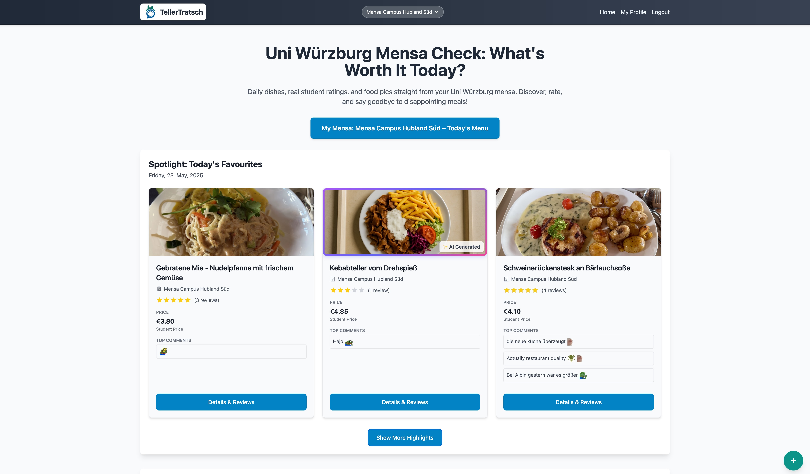

# TellerTratsch Issue Tracker

Bug reports, feature requests, and roadmap discussions for [TellerTratsch.de](https://tellertratsch.de) - a platform for rating and reviewing university mensa meals in Würzburg.

**Perfect for:**
- 🐛 Bug reports
- ✨ Feature requests
- 💡 Roadmap discussions

## Contributing

> [!NOTE]
> Please search existing issues first to join existing thoughts and avoid duplicates.

We welcome all feedback! Use English or German, and try to provide some details to help us address your thoughts optimally: 

**For bugs:**
Please try to include: 
- Browser and device info
- Steps to reproduce
- Expected vs actual behavior
- Screenshots are always helpful!

**For feature requests:**
Please include: 
- What problem you're trying to solve
- Your proposed solution

**For discussions:**
- Future roadmap ideas
- Platform improvements
- Community suggestions

## Labels

**Type:**
- `bug` - Something broken
- `feature` - New functionality  
- `enhancement` - Improvement to existing feature
- `discussion` - Ideas and roadmap talk
- `question` - General question

**Priority:**
- `critical` - Site-breaking
- `high` - Important
- `medium` - Nice to have
- `low` - Minor

**Area:**
- `authentication` - Login/LDAP issues
- `meals` - Menu display, data, filtering
- `ratings` - Reviews, comments, voting
- `ui/ux` - Interface issues
- `mobile` - Mobile-specific
- `performance` - Speed/optimization
- `localization` - Translation and language issues

## Contact

Use the Tellertratsch's [contact form](https://tellertratsch.de/feedback) to get into direct, private contact with me. 
